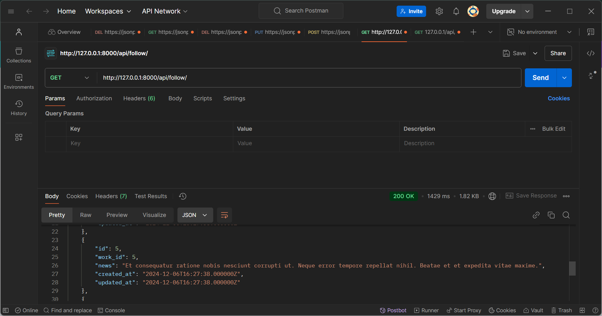

## Job Tracking Project Overview
The Job Tracking Server project aims to develop a web-based application for managing and tracking job assignments, tasks, and employee progress. The system will provide a centralized platform for administrators to create and assign jobs, track employee work hours, and monitor project status.

## Key Features

Job Management,
Employee Management,
Management,
Security.

## Technical Requirements

Backend: Develop the server-side logic using a programming language such as Python, Node.js, or Blade.
Frontend: Design a user-friendly interface using a framework such as React, Angular, or Vue.js.
Database: Choose a suitable database management system such as MySQL, PostgreSQL, or MongoDB to store job, employee, and task data.
API: Implement RESTful APIs for data exchange between the frontend and backend.

## Development Roadmap

Backend Development: Develop the server-side logic using the chosen programming language and framework.
Frontend Development: Design and implement the user interface using the chosen frontend framework.
API Development: Implement RESTful APIs for data exchange between the frontend and backend.
Testing and Deployment: Conduct thorough testing, deploy the application, and ensure smooth operation.

##ScreenShots

## License

The Laravel framework is open-sourced software licensed under the [MIT license](https://opensource.org/licenses/MIT).

# JobTracking